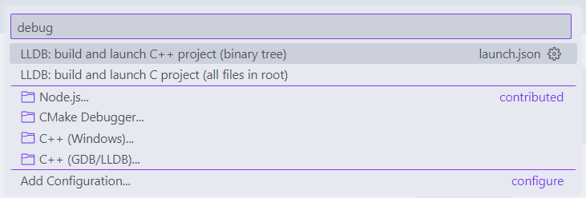
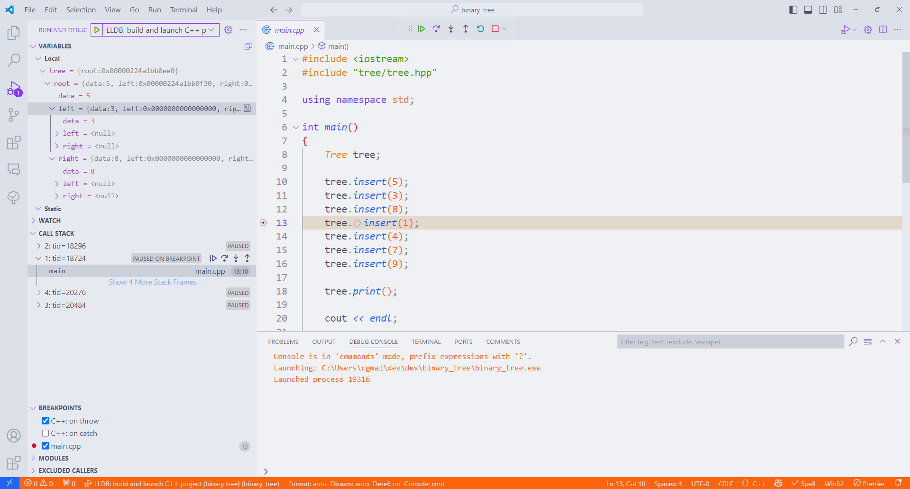

# Compilando um projeto em C++

O **Clang** também permite compilar projetos em C++ da mesma forma como fizemos com C.
Vamos criar um novo projeto em C++ para testar o compilador.

## Compilando um único arquivo

Criemos uma nova pasta em `~/dev`, chamada `binary_tree`.
Dentro dela, crie um arquivo `main.cpp`.
Por enquanto, vamos escrever um código simples para testar o compilador.

```cpp
#include <iostream>

using namespace std;

int main()
{
    cout << "Hello, World!" << endl;
    return 0;
}
```

Para compilar o código, usamos o comando `clang++` em vez de `clang`.
Faça o seguinte:

```bash
clang++ main.cpp -o binary_tree
./binary_tree
```

Se tudo estiver correto, você verá a mensagem `Hello, World!` impressa no terminal.

## Compilando um projeto com vários arquivos

Vamos editar este projeto para de fato representar uma árvore binária.
Crie duas pastas dentro do projeto: `tree` e `node`.

- Dentro de `tree`, crie um arquivo `tree.cpp` e um `tree.h`.
- Dentro de `node`, crie um arquivo `node.cpp` e um `node.h`.

Copie o código dos arquivos em [`/code/binary_tree`](/code/binary_tree/) e cole nos arquivos correspondentes do seu projeto.

Para compilar um projeto em C++, utilizamos o seguinte comando:

```bash
clang++ [arquivos.cpp] -I [pastas_com_arquivos_hpp] -o [nome_do_executável]
```

Ou seja, precisamos especificar a localização de todos os arquivos que desejamos incluir e compilar.
Uma vez que nosso projeto tem mais de uma pasta internamente, precisamos especificar a localização de ambas.
Execute o seguinte:

```bash
clang++ tree/tree.cpp node/node.cpp main.cpp -I tree -I node -o binary_tree
```

Se tudo estiver correto, ao executar `./binary_tree`, você verá os nós da árvore binária sendo impressos no terminal em ordem crescente.


## Configurando tarefa de compilação

Também podemos criar um arquivo `tasks.json` para compilar o projeto diretamente do Visual Studio Code.
Copie o arquivo definido em [`/code/binary_tree/.vscode/tasks.json`](/code/binary_tree/.vscode/tasks.json) para o seu projeto.

Fizemos algumas mudanças em relação à tarefa de compilação em C.
Primeiramente, alteramos o nome do comando, para não confundir com o anterior.

```json
// Antes
"label": "Clang: build C project (all files in root)",
// Depois
"label": "Clang: build C++ project (binary tree)",
```

Então, alteramos o comando de compilação para `clang++`.

```json
// Antes
"command": "C:\\msys64\\clang64\\bin\\clang.exe",
// Depois
"command": "C:\\msys64\\clang64\\bin\\clang++.exe",
```

Precisamos também trocar a extensão dos arquivos para `.cpp` e incluir as pastas `tree` e `node` nos argumentos de compilação.

```json
// Antes
"args": [
  ...
  "${workspaceFolder}\\*.c",
  ...
],

// Depois
"args": [
  ...
  "${workspaceFolder}\\*.cpp",
  "${workspaceFolder}\\node\\*.cpp",
  "${workspaceFolder}\\tree\\*.cpp",
  ...
],
```

É necessário também listar as pastas `tree` e `node` nos argumentos de inclusão de cabeçalho.

```json
// Antes
"args": [
  ...
  "-I",
  "${workspaceFolder}",
  ...
],

// Depois
"args": [
  ...
  "-I",
  "${workspaceFolder}",
  "-I",
  "${workspaceFolder}\\node",
  "-I",
  "${workspaceFolder}\\tree",
  ...
],
```

Como esse arquivo deve ser alterado para cada estrutura de um projeto, não é possível generalizar um arquivo `tasks.json` para todos os projetos em C++.
Por isso, é importante entender o que cada parte do arquivo faz e adaptá-lo conforme necessário.

Para executá-lo, abra a **Paleta de Comandos** do Visual Studio Code com `Ctrl+Shift+P` e digite `Tasks: Run Build Task`.


Selecione a tarefa `Clang: build C++ project (binary tree)` e pressione `Enter`.


## Depurando o projeto

O arquivo de configuração de depuração que fizemos anteriormente tinha duas fases:

- Chama a tarefa de compilação definida em `tasks.json`
- Executa o comando de depuração, que usa o LLDB

Uma vez que mudamos o nome da tarefa de compilação, precisamos alterar essa chamada no arquivo de configuração de depuração.

Disponibilizamos a versão atualizada neste repositório.
Copie o arquivo de configuração de depuração em [`/code/binary_tree/.vscode/launch.json`](/code/binary_tree/.vscode/launch.json) para o seu projeto.

Alteramos o nome da tarefa de depuração:

```json
// Antes
"name": "LLDB: build and launch C project (all files in root)",
// Depois
"name": "LLDB: build and launch C++ project (binary tree)",
```

E o nome da tarefa de compilação que é chamada:

```json
// Antes
"preLaunchTask": "Clang: build C project (all files in root)",
// Depois
"preLaunchTask": "Clang: build C++ project (binary tree)",
```

Agora abra a **Paleta de Comandos** do Visual Studio Code com `Ctrl+Shift+P` e digite `Debug: Select and Start Debugging`.
Seleciona a tarefa `LLDB: build and launch C++ project (binary tree)` e pressione `Enter`.


Seleção da tarefa de depuração:



Visualização da depuração:



## Configurações globais

Assim como fizemos para projetos em C, você poderia criar um arquivo `tasks.json` que compila todos os arquivos `.cpp` da raiz de um projeto, sem se importar com a estrutura de pastas.

Disponibilizamos o arquivo `tasks.json` configurado dessa forma em [`/config/cpp_tasks.json`](/config/cpp_tasks.json).
O nome da tarefa de compilação definida é `Clang: build C++ project (all files in root)`.

Também disponibilizamos uma versão atualizada do arquivo `settings.json` em [`/config/cpp_settings.json`](/config/cpp_settings.json), que inclui a configuração global de depuração.
O nome da tarefa de depuração definida é `LLDB: build and launch C++ project (all files in root)`.

Lembre-se: para editar as configurações do perfil, abra a **Paleta de Comandos** do Visual Studio Code com `Ctrl+Shift+P` e digite `Preferences: Open User Settings (JSON)`.


E para editar as tarefas de compilação, abra a **Paleta de Comandos** do Visual Studio Code com `Ctrl+Shift+P` e digite `Tasks: Open User Tasks (JSON)`.


---

> ➡️ [**Próximo capítulo**](/chapters/cmake/text.md)\
> ⬅️ [**Capítulo anterior**](/chapters/c_project_vscode/text.md)\
> 🏠 [**Página inicial**](/README.md)
