+++
  title = "Git"
  type = "chapter"
  weight = 4
+++

O **Git** é um sistema de controle de versão distribuído.
Ele é muito utilizado para controle de versão de código fonte e colaboração em projetos de software.

## Instalação

### Ubuntu e WSL

Para instalar o Git no Ubuntu, ou no WSL utilizando o Ubuntu como distro, basta executar o comando:

```bash
sudo apt install git
```

### Fedora

Para instalar o Git no Fedora, execute o comando:

```bash
sudo dnf install git
```

### Windows

O Git é focado em sistemas Unix-like.
Para usá-lo no Windows, é necessário instalar uma versão específica chamada **Git for Windows** (bem auto-descritivo).

Você pode baixar o instalador pelo [site oficial](https://gitforwindows.org/).
Execute o instalador e siga as instruções.

<figure>

<figcaption>Tela inicial do instalador do Git para Windows.</figcaption>
</figure>

Quando perguntado sobre o editor de texto padrão, você pode escolher o **Visual Studio Code**, caso o tenha instalado.

<figure>

<figcaption>Seleção do editor de texto padrão do Git.</figcaption>
</figure>

Na sessão **Adjusting the name of the initial branch in new repositories**, você pode escolher o nome da branch padrão.
Recomendo selecionar a opção **Override the default branch name for new repositories** e digitar `main`, uma vez que este é o padrão adotado pelo _GitHub_.

<figure>
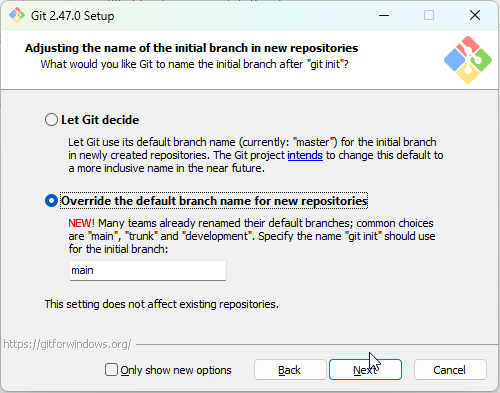
<figcaption>Seleção do nome padrão de branch.</figcaption>
</figure>

Na seção **Adjusting your PATH environment**, selecione **Git from the command line and also from 3rd-party software**.

<figure>
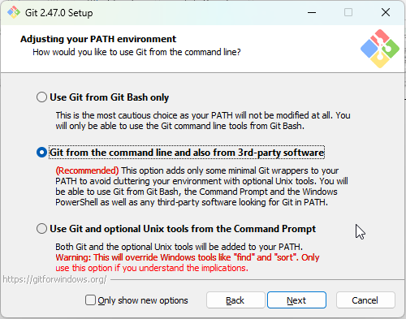
<figcaption>Seleção da configuração da PATH.</figcaption>
</figure>

Na seção **Choosing the SSH executable**, selecione **use external OpenSSH**.

<figure>
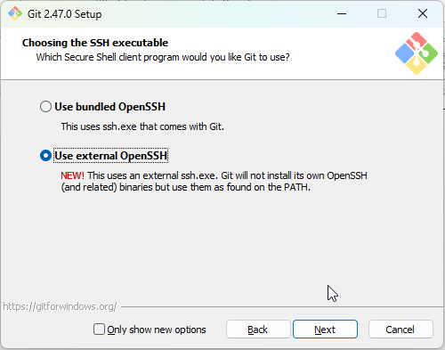
<figcaption>Seleção do executável do OpenSSH.</figcaption>
</figure>

Nas próximas sessões, pode manter as opções padrão, até a **Configuring extra options**, em que recomendo marcar também a caixa **Enable symbolic links**.

<figure>
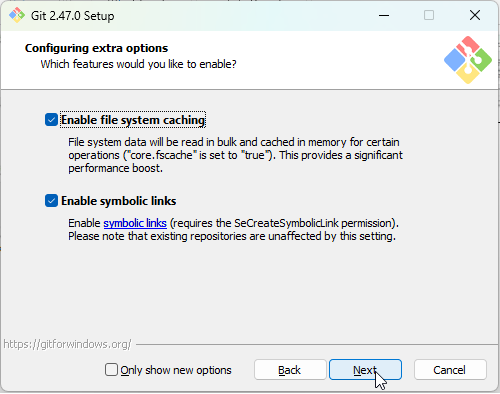
<figcaption>Seleção das configurações extra.</figcaption>
</figure>

O Git for Windows configura automaticamente a Path para seu executável.

Para testar se a instalação foi bem-sucedida, **feche** e abra o PowerShell novamente, então execute o comando:

```bash
git --version
```

Se tudo estiver correto, você verá a versão do Git instalada, como `git version 2.47.0.windows.1`, por exemplo, ou superior.

## Configuração

Após instalar o Git, é necessário definir algumas configurações globais para melhorar a experiência de uso.
Esta seção pode ser aplicada para todos os **sistemas operacionais** apresentados: Ubuntu, Fedora e Windows (PowerShell e WSL).

### Nome e e-mail

Para definir o nome e e-mail, execute os comandos abaixo, substituindo os valores entre aspas pelo seu nome e seu e-mail.

```bash
git config --global user.name "Seu Nome"
git config --global user.email "seu@email.com"
```

Para verificar se as configurações foram aplicadas corretamente, execute os mesmo comandos, mas sem o conteúdo

<figure>

<figcaption>Definição do nome de autoria dos commits.</figcaption>
</figure>

### Editor de texto

Para definir o editor de texto padrão, execute o comando abaixo, substituindo `code` pelo comando que abre o Visual Studio Code no seu sistema.

```bash
git config --global core.editor "code --wait"
```

<!-- TODO: verificar -->

### Branch padrão

Para definir a branch padrão como `main`, execute o comando abaixo.

```bash
git config --global init.defaultBranch main
```

## Github

O **GitHub** é uma plataforma de hospedagem de código fonte e colaboração em projetos de software.

Para obter commits de repositórios privados e fazer o envio para eles, é necessário configurar a autenticação do seu terminal.

### Instalação do GitHub CLI

Para autenticar o Git com o GitHub, eu recomendo instalar uma ferramenta chamada **GitHub CLI**.
Ele permite fazer login no GitHub e gerenciar repositórios diretamente do terminal.

Você pode conhecer sobre o projeto e aprender os comandos disponíveis pelo [site oficial](https://cli.github.com/).

A instalação depende do sistema operacional que você está utilizando.

#### Ubuntu e WSL

Para instalar o GitHub CLI no Ubuntu, ou no WSL utilizando o Ubuntu como distro, vamos seguir a [documentação oficial](https://github.com/cli/cli/blob/trunk/docs/install_linux.md#debian-ubuntu-linux-raspberry-pi-os-apt).

Este comando adiciona o repositório do GitHub CLI ao seu sistema, e então instala o pacote.

```bash
(type -p wget >/dev/null || (sudo apt update && sudo apt-get install wget -y)) \
&& sudo mkdir -p -m 755 /etc/apt/keyrings \
&& wget -qO- https://cli.github.com/packages/githubcli-archive-keyring.gpg | sudo tee /etc/apt/keyrings/githubcli-archive-keyring.gpg > /dev/null \
&& sudo chmod go+r /etc/apt/keyrings/githubcli-archive-keyring.gpg \
&& echo "deb [arch=$(dpkg --print-architecture) signed-by=/etc/apt/keyrings/githubcli-archive-keyring.gpg] https://cli.github.com/packages stable main" | sudo tee /etc/apt/sources.list.d/github-cli.list > /dev/null \
&& sudo apt update \
&& sudo apt install gh -y
```

<figure>
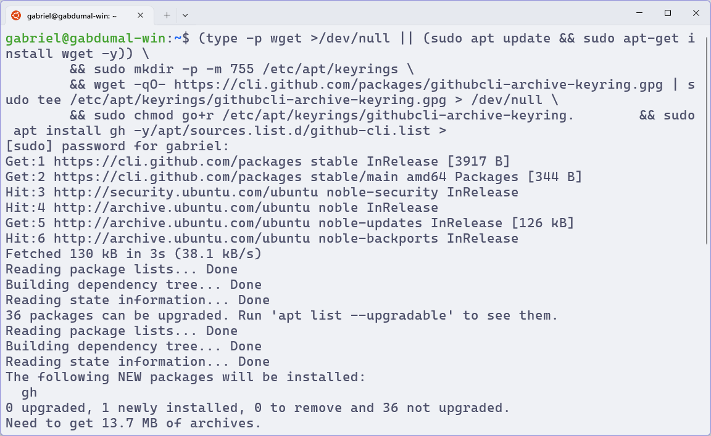
<figcaption>Instalação do GitHub CLI no WSL.</figcaption>
</figure>

#### Fedora

Para instalar o GitHub CLI no Fedora, vamos seguir a [documentação oficial](https://github.com/cli/cli/blob/trunk/docs/install_linux.md#fedora-centos-red-hat-enterprise-linux-dnf).

Este comando adiciona o repositório do GitHub CLI ao seu sistema, e então instala o pacote.

```bash
sudo dnf install 'dnf-command(config-manager)'
sudo dnf config-manager --add-repo https://cli.github.com/packages/rpm/gh-cli.repo
sudo dnf install gh --repo gh-cli
```

#### Windows

Para instalar o GitHub CLI no Windows, sem o WSL, vamos seguir a [documentação oficial](https://github.com/cli/cli?tab=readme-ov-file#windows).

Abra o **PowerShell** e execute o comando abaixo.

```bash
winget install --id GitHub.cli
```

<figure>
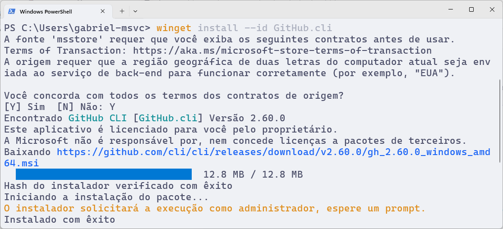
<figcaption>Instalando o GitHub CLI no PowerShell.</figcaption>
</figure>

Alternativamente, você pode baixar o instalador pelo [site oficial](https://cli.github.com/).

**Feche** e abra o PowerShell novamente para que as mudanças sejam aplicadas.

Você pode verificar se a instalação foi bem-sucedida executando o comando `gh --version`.

<figure>
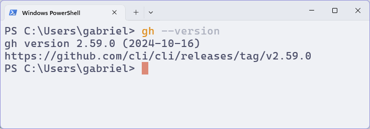
<figcaption>Confirmação da instalação do GitHub CLI no PowerShell.</figcaption>
</figure>

### Autenticação

Para autenticar o GitHub CLI, execute o seguinte comando.

```bash
gh auth login
```

O GitHub CLI irá apresentar uma série de escolhas para você decidir como deseja se autenticar.

Siga o seguinte passo a passo:

1. Escolha o método de autenticação. Você deve usar o `GitHub.com`.
1. Escolha o protocolo de autenticação. Caso você já tenha definido uma chave SSH no GitHub e saiba o que está fazendo, você pode escolher `SSH`. Caso contrário, escolha `HTTPS`.
1. Quando perguntado sobre autenticar com as credenciais do GitHub, digite `Y`.
1. Quando solicitada a forma de log-in, selecione `Login with a web browser`, e pressione <kbd>Enter</kbd>.

O GitHub CLI irá então exibir um código de oito caracteres, e um link para você acessar no seu navegador.

<figure>
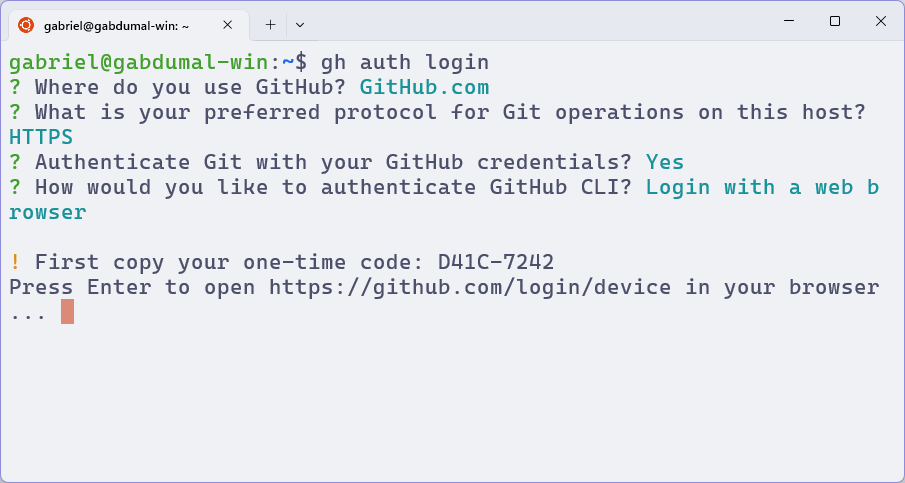
<figcaption>Autenticação no terminal do WSL por meio do gitHub CLI.</figcaption>
</figure>

Copie o **link** e abra em um navegador em que você já esteja logado no GitHub.
Então, selecione sua conta, cole o código de oito caracteres no campo de texto e clique em `Continue`.

<figure>
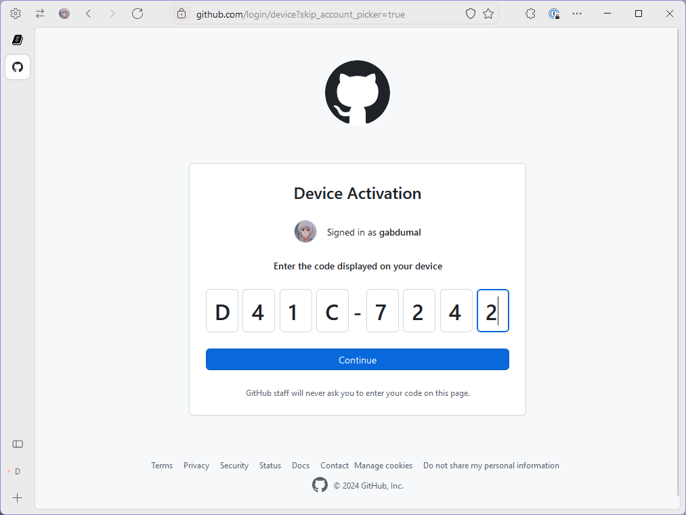
<figcaption>Código de autenticação do GitHub CLI colado no navegador.</figcaption>
</figure>

No meu caso, o WSL não conseguir abrir o navegador, então ele exibiu esse pequeno erro, mas foi só copiar o link e abrir no navegador que funcionou.

<figure>
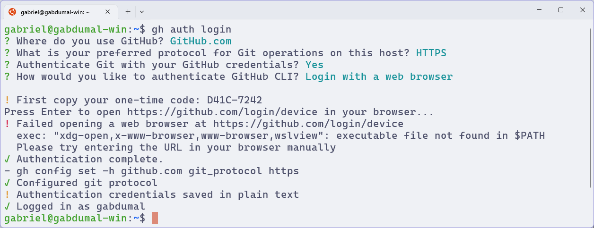
<figcaption>Resultado da autenticação pelo navegador.</figcaption>
</figure>

### Visual Studio Code

Você também pode se autenticar no GitHub pelo Visual Studio Code.
Eu recomendo fazer isso como complemento ao GitHub CLI, mas não como substituto.

Selecione o ícone do perfil (o que tem a imagem de uma pessoa) no canto inferior esquerdo, e então clique em `Sign in to Sync Settings`.

<figure>
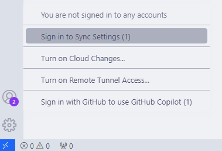
<figcaption>Menu de log-in do Visual Studio Code.</figcaption>
</figure>

Quando perguntado sobre a forma de autenticação, selecione `GitHub`.

O Visual Studio Code irá abrir uma aba no seu navegador, onde você deve selecionar sua conta e autorizar o acesso.

<figure>

<figcaption>Autorização de log-in no GitHub pelo Visual Studio Code.</figcaption>
</figure>
