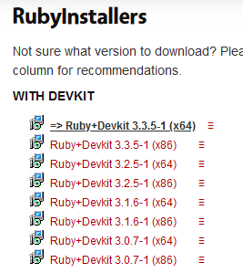
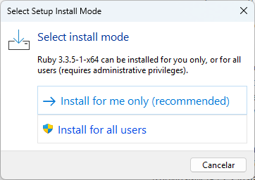
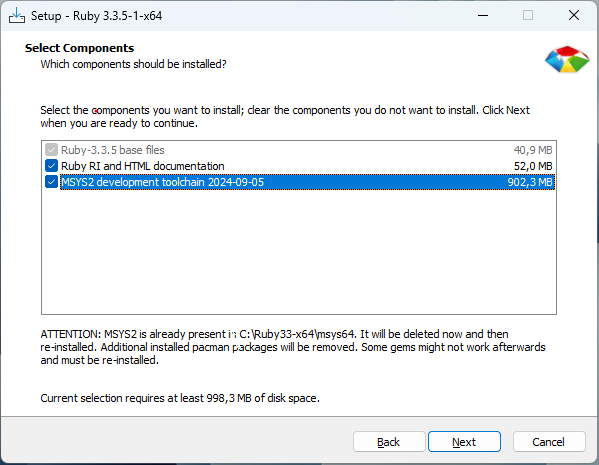
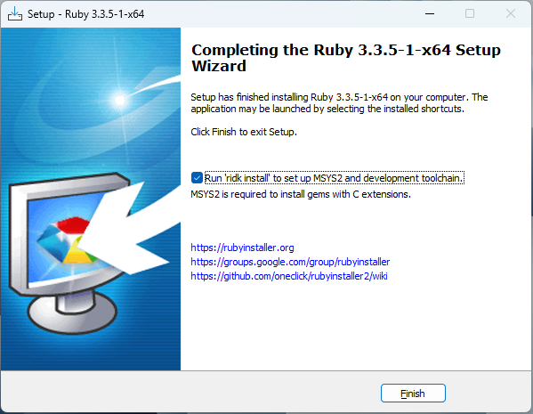
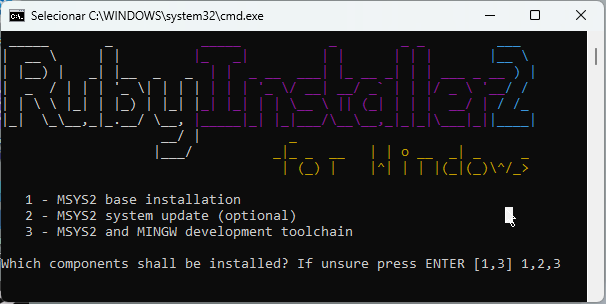
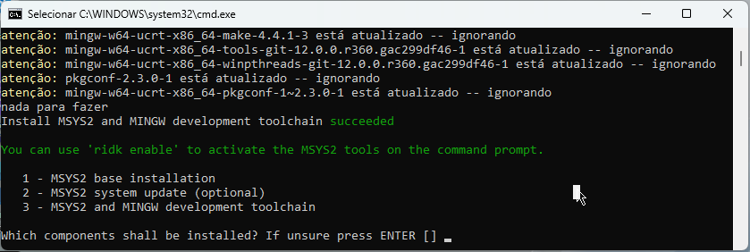

+++
  title = "Ruby"
  type = "chapter"
  weight = 12
+++

<https://www.ruby-lang.org/pt/>

## Instalação

<https://www.ruby-lang.org/pt/documentation/installation/>

### Windows

<https://rubyinstaller.org/downloads/>

`1,2,3` <kbd>Enter</kbd>

<kbd>Enter</kbd>

`ruby --version`
`ruby 3.3.5 (2024-09-03 revision ef084cc8f4) [x64-mingw-ucrt]`

`gem --version`
`3.5.16`
