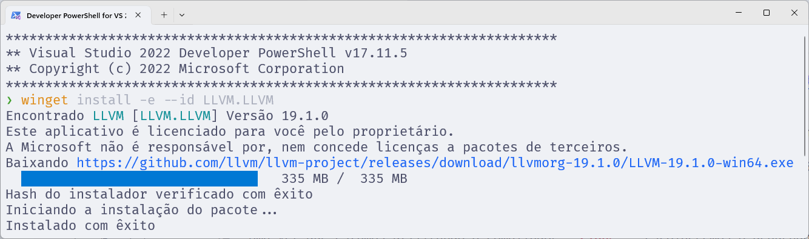

# Depurador

O depurador é uma ferramenta que permite que você execute um programa passo a passo, inspecionando variáveis e observando o fluxo de execução.
Isso é útil para encontrar bugs e entender o comportamento do programa.

Você pode já ter utilizado o depurador [**GDB**](https://www.sourceware.org/gdb/) (GNU Debugger).
Ele é do mesmo projeto do GCC (GNU Compiler Collection).

Apesar de ser comumente utilizado para depurar códigos em C e C++, o GDB, além de outros depuradores, podem suportar outras linguagens.
Isso depende da forma como o compilador gera o código objeto e provê informações de depuração.

Então percebemos que, para o depurador funcionar, ele deve ser compatível com o compilador que gerou o binário.

Uma vez que estamos utilizando o compilador **Clang**, escolheremos o depurador [**LLDB**](https://lldb.llvm.org/) (LLVM Debugger), que também é parte do projeto LLVM.

O LLDB depende de ter instalado o Python.
Em sistemas Linux (incluindo WSL), o Python já vem instalado.
Já para o Windows, leia o capítulo [Python](/src/chapters/python/index.md).

## Windows

