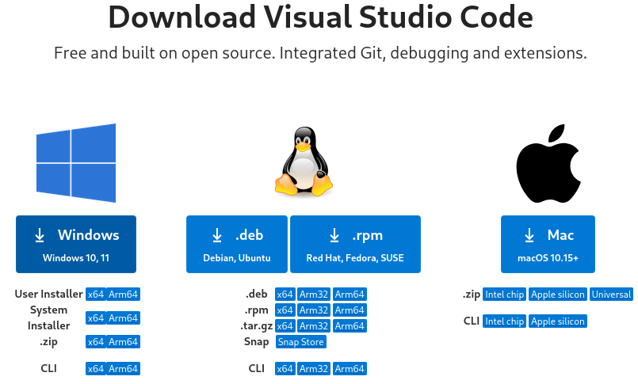

# Instalando o VsCode { #installing-vscode }

A fim de escrever código, você precisará de um editor de texto apropriado.
É interessante que ele seja voltado para o desenvolvimento de software, com funcionalidades como _syntax highlighting_, _code completion_, _debugging_, etc.

O **Visual Studio Code** é um editor de texto muito popular entre desenvolvedores.
Ele é leve, rápido e possui uma grande quantidade de extensões que facilitam o desenvolvimento de software.

Para este guia, vamos utilizar o Visual Studio Code e configurá-lo para compilar e depurar código em C e C++.

## Windows

Você pode fazer o download do editor pelo [site oficial](https://code.visualstudio.com/Download).

<figure>

<figcaption>Opções de download do Visual Studio Code, em que se seleciona o instalador do Windows.</figcaption>
</figure>

Execute o instalador e siga as instruções.

<!-- TODO: Adicionar imagens da instalação -->

## Ubuntu

Para instalar o Visual Studio Code no Ubuntu, e em outros sistemas que utilizam o gerenciador de pacotes `apt` (como Mint, Debian, Pop!\_OS, entre outros), podemos adicionar o repositório oficial do Visual Studio Code, o que o manterá atualizado automaticamente.

Para isso, utilize os seguintes comandos, conforme recomendado pelo [site oficial](https://code.visualstudio.com/docs/setup/linux#_debian-and-ubuntu-based-distributions).

```bash
sudo apt-get install wget gpg
wget -qO- https://packages.microsoft.com/keys/microsoft.asc | gpg --dearmor > packages.microsoft.gpg
sudo install -D -o root -g root -m 644 packages.microsoft.gpg /etc/apt/keyrings/packages.microsoft.gpg
echo "deb [arch=amd64,arm64,armhf signed-by=/etc/apt/keyrings/packages.microsoft.gpg] https://packages.microsoft.com/repos/code stable main" |sudo tee /etc/apt/sources.list.d/vscode.list > /dev/null
rm -f packages.microsoft.gpg
```

Em seguida, atualize a lista de pacotes e instale o Visual Studio Code:

```bash
sudo apt install apt-transport-https
sudo apt update
sudo apt install code
```

## Fedora

Para instalar o Visual Studio Code no Fedora, também podemos adicionar o repositório oficial do Visual Studio Code.

Utilize os seguintes comandos, conforme recomendado pelo [site oficial](https://code.visualstudio.com/docs/setup/linux#_rhel-fedora-and-centos-based-distributions):

```bash
sudo rpm --import https://packages.microsoft.com/keys/microsoft.asc
echo -e "[code]\nname=Visual Studio Code\nbaseurl=https://packages.microsoft.com/yumrepos/vscode\nenabled=1\ngpgcheck=1\ngpgkey=https://packages.microsoft.com/keys/microsoft.asc" | sudo tee /etc/yum.repos.d/vscode.repo > /dev/null
```

Em seguida, instale o Visual Studio Code:

```bash
dnf check-update
sudo dnf install code
```
