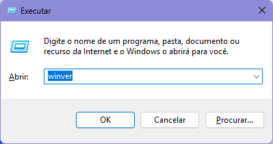
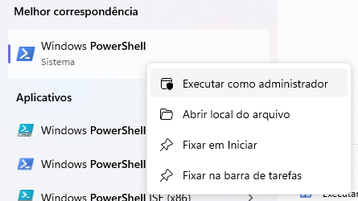

# Instalando o WSL

O **Windows Subsystem for Linux (WSL)** é uma ferramenta de código aberto apoiada pela Microsoft que permite a emulação de um sistema operacional Linux dentro do Windows.
A atual versão na data de escrita deste livro é a 2, que traz grandes melhorias em relação à versão anterior.

O WSL permite instalar diversas distribuições Linux, até mesmo concomitantemente.
Este [guia oficial](https://learn.microsoft.com/en-us/windows/wsl/install-manual#step-6---install-your-linux-distribution-of-choice) da Microsoft mostra algumas opções.
Para este guia, vamos nos manter na distribuição **Ubuntu 22.04 LTS**, que é a padrão do WSL.

## Pré-requisitos

Se você estiver usando o **Windows 11**, ou o **Windows 10 versão 2004** (Build 19041) ou superior, o WSL 2 já estará habilitado, e você pode pular para a próxima seção.

<div class="warning">
  <p>
    Para verificar a versão do seu Windows, pressione <kbd>Win</kbd> + <kbd>R</kbd> e digite <code>winver</code>. Então, pressione <kbd>Enter</kbd>.
  </p>
  <figure>
    
    <figcaption>Verificando a versão do Windows pelo Executar.</figcaption>
  </figure>
</div>

Caso utilize uma versão mais antiga, seguiremos os passos recomendados pelo [guia oficial](https://learn.microsoft.com/en-us/windows/wsl/install-manual#step-1---enable-the-windows-subsystem-for-linux) da Microsoft.

Ainda assim, para sistemas com arquitetura x64, é necessário ter instalado a **versão 1903** do Windows 10 ou posterior, com a Build 18362.1049 ou posterior.
Versões mais antigas do Windows 10 não possuem suporte para o WSL 2.

Como alternativa, você pode ler o capítulo [Instalando o MSVC](/src/chapters/installing_msvc/index.md) para compilar programas diretamente para executáveis do Windows.

<!-- TODO: Atualizar link para o capítulo -->

### Habilitando o WSL

Para habilitar o WSL no sistema, abra o PowerShell como **administrador** e execute o comando abaixo.

```powershell
dism.exe /online /enable-feature /featurename:Microsoft-Windows-Subsystem-Linux /all /norestart
```

<div class="warning">
  <p>
    Lembre-se, para abrir o PowerShell como administrador, clique com o botão direito na entrada do PowerShell no Menu Iniciar e selecione a opção <span class="bold">Executar como administrador</span>.
  </p>
  <figure>
    
    <figcaption>Executando o Powershell como administrador a partir do Menu Iniciar.</figcaption>
  </figure>
</div>

### Habilitando a Virtualização

Para habilitar a virtualização no sistema, execute o comando abaixo no PowerShell como **administrador**.

```powershell
dism.exe /online /enable-feature /featurename:VirtualMachinePlatform /all /norestart
```

### Atualizando para o WSL 2

Baixe o pacote de atualização do WSL 2 pelo [repositório da Microsoft](https://wslstorestorage.blob.core.windows.net/wslblob/wsl_update_x64.msi) e instale-o.
Você pode verificar a origem do link pelo [guia oficial](https://learn.microsoft.com/en-us/windows/wsl/install-manual#step-4---download-the-linux-kernel-update-package) da Microsoft.

Após o download, execute o instalador e siga as instruções.

### Definindo o WSL 2 como padrão

Por fim, defina a versão 2 do WSL como padrão com o comando abaixo, ainda no PowerShell como **administrador**.

```powershell
wsl --set-default-version 2
```
