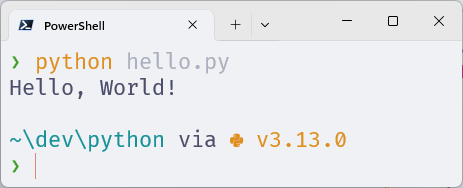
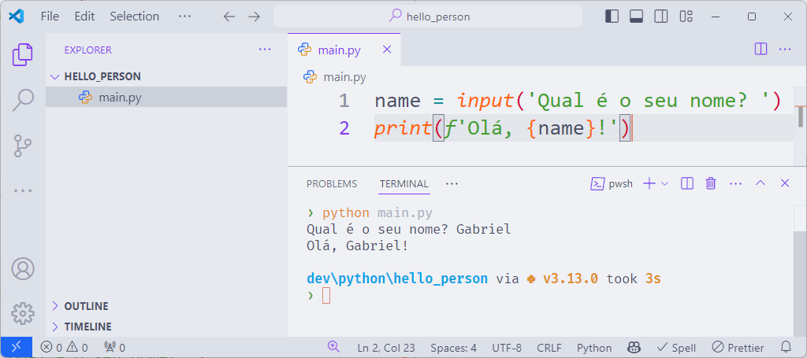

# Interpretando um arquivo

O Python é um linguagem interpretada, que executa um arquivo linha por linha.
Dessa forma, não é necessário compilar o código antes de executá-lo.
Basta chamar o interpretador Python e passar o arquivo como argumento.

Eu gosto de organizar meus projetos em uma pasta chamada `dev` na raiz da minha pasta de usuário.
A criação dessa pasta foi tratada no capítulo [Windows Subsystem for Linux](/src/chapters/wsl/index.md).

## Olá, Mundo

Para os sistemas **Ubuntu** e **Fedora**, basta executar o seguinte comando para criar a pasta `dev`:

```bash
mkdir ~/dev
```

Já para o **Windows**, você pode executar o seguinte comando no PowerShell:

```powershell
mkdir $HOME/dev
```

Então, vamos criar dentro dela uma pasta chamada `python` e um arquivo chamado `hello.py`:

Para os sistemas **Ubuntu**, **Fedora** e **WSL**, execute o seguinte comando:

```bash
mkdir ~/dev/python
```

Já para o **Windows**, execute o seguinte comando no PowerShell:

```powershell
mkdir $HOME/dev/python
```

Por fim, criemos o arquivo `hello.py` dentro da pasta `python`:

```powershell
cd $HOME/dev/python
echo "print('Hello, World!')" > hello.py
```

Para executar o arquivo, basta chamar o interpretador Python e passar o arquivo como argumento:

```powershell
python hello.py
```

<figure>

<figcaption>Execução do script "hello".</figcaption>
</figure>

## Visual Studio Code

Vamos criar um projeto para editar no Visual Studio Code.

Crie uma pasta dentro do diretório `python` recém-criado chamada `hello_person`:

```powershell
mkdir $HOME/dev/python/hello_person
```

Então, abra o Visual Studio Code nessa pasta:

```powershell
code $HOME/dev/python/hello_person
```

Por dentro do VSCode, crie um arquivo chamado `main.py` e adicione o seguinte código:

```python
name = input('Qual é o seu nome? ')
print(f'Olá, {name}!')
```

Abra o terminal do Visual Studio Code e execute o script:

```powershell
python main.py
```

<figure>

<figcaption>Execução do script "main" do projeto "hello_person" por dentro do Visual Studio Code.</figcaption>
</figure>
