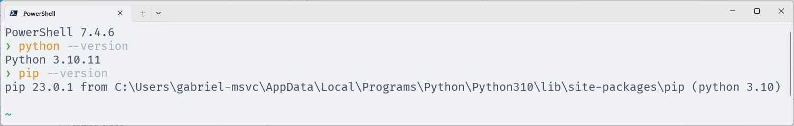

# Instalação

O Python é instalado por padrão no Ubuntu (e WSL) e no Fedora, bastando verificar se as ferramentas auxiliares estão instaladas.
Já no Windows, é necessário instalar o Python manualmente.

## Linux

<!-- TODO -->

## Windows

Para instalar o Python no Windows, acesse a página de [downloads](https://www.python.org/downloads/windows/) e baixe a versão mais recente.

Se seu computador for de 64 bits (e muito provavelmente é, a não ser que seja realmente **muito** velho), baixe a versão de 64 bits.
Caso contrário, baixe a versão de 32 bits.

Execute o instalador.
Na primeira tela, marque as opções:

- Use admin privileges when installing py.exe.
- Add Python to PATH.

Então, clique em **Install Now**.

<figure>

<figcaption>Instalação do Python para Windows.</figcaption>
</figure>

Aguarde a instalação terminar.
Então, clique em **Close**.

<figure>

<figcaption>Finalizar instalação do Python para Windows.</figcaption>
</figure>

Para verificar se a instalação foi bem-sucedida, abra o **Powershell** e digite os comandos:

```bash
python --version
pip --version
```

<figure>

<figcaption>Verificando se a instalação do Python foi bem-sucedida.</figcaption>
</figure>
