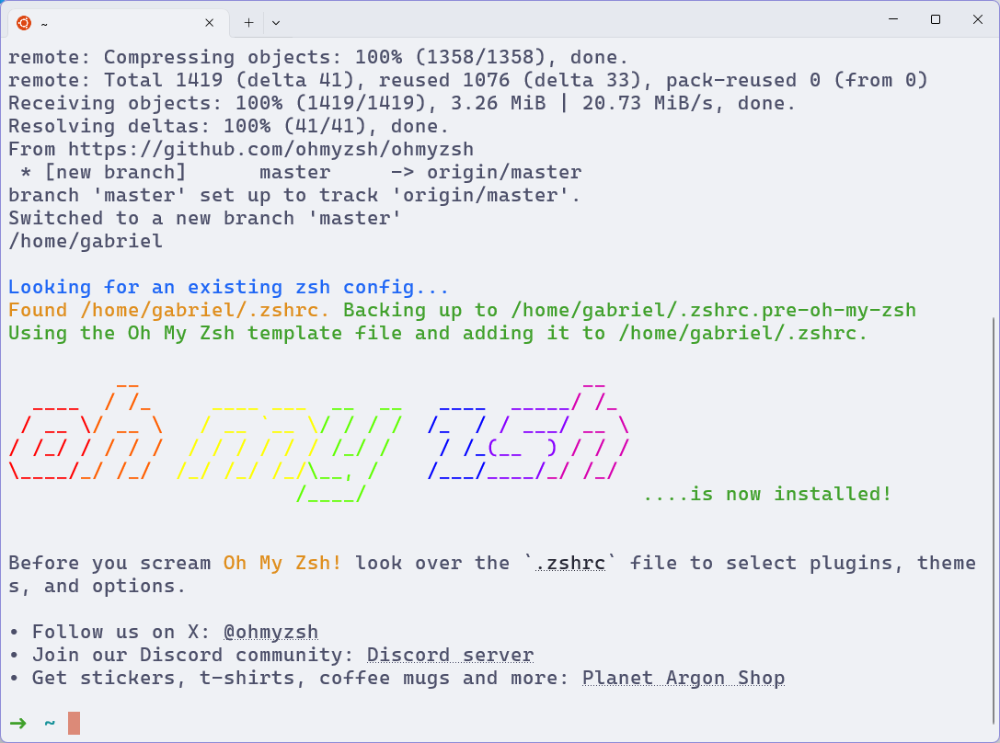
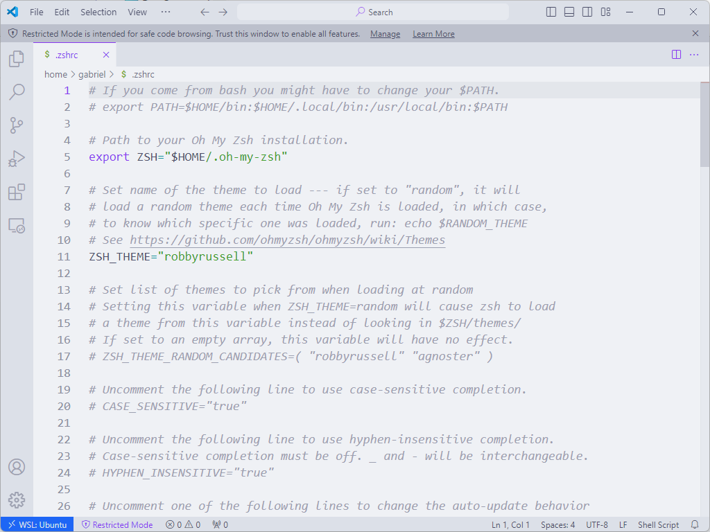
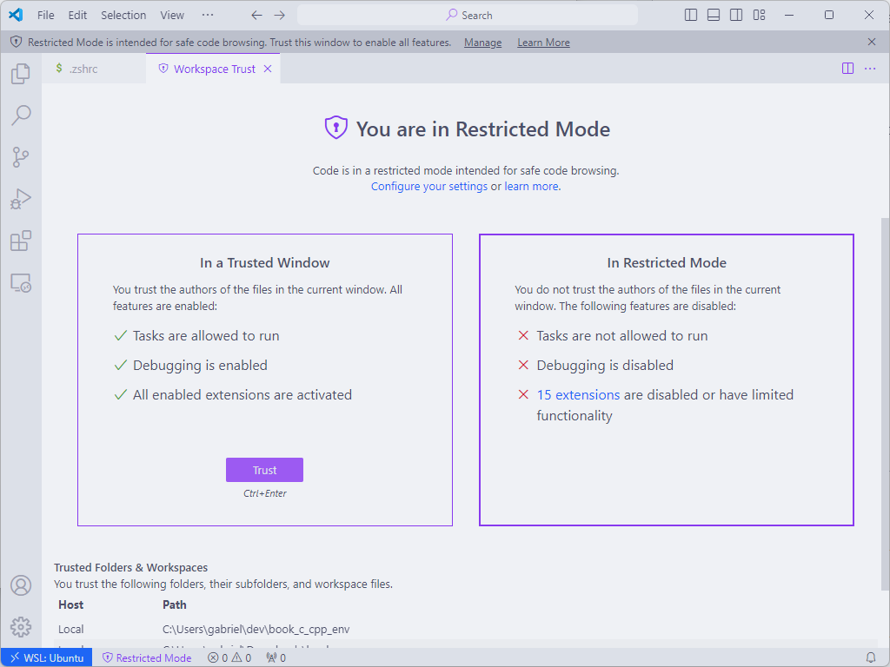

# Oh My Zsh

O **Oh My Zsh** é um framework para gerenciar a configuração do zsh.
Ele é altamente _customizável_ e _extensível_, graças a uma grande quantidade de _plugins_ e _temas_ disponíveis.

Uma vez que ele depende do Zsh, sua instalação pode ser feita no Ubuntu, no Fedora e no WSL, mas não no PowerShell.

## Instalação

Suas instruções de instalação estão disponíveis no seu [repositório no GitHub](https://github.com/ohmyzsh/ohmyzsh?tab=readme-ov-file#basic-installation).

Execute o seguinte comando no terminal para instalar o Oh My Zsh:

```bash
sh -c "$(wget -O- https://raw.githubusercontent.com/ohmyzsh/ohmyzsh/master/tools/install.sh)"
```

Além de instalar o Oh My Zsh, o script de instalação também configura o arquivo `.zshrc` de forma a carregar o framework.

<figure>

<figcaption>Script de instalação do Oh My Zsh sendo executado no Ubuntu WSL.</figcaption>
</figure>

## Configuração

**Feche** e abra um novo terminal para que as alterações feitas no arquivo `.zshrc` tenham efeito.

Vamos usar um editor de texto para abrir o arquivo de configuração.
Como já instalamos o Visual Studio Code, podemos usá-lo.

Digite no terminal o seguinte comando:

```bash
code ~/.zshrc
```

O `~` é um atalho para a pasta do usuário, ou seja, `/home/gabriel` no meu caso.
Dentro dela, está o arquivo `.zshrc`.

<figure>

<figcaption>Arquivo de configuração do Zsh exibido no VsCode, com o aviso de arquivo modo restrito.</figcaption>
</figure>

Caso dentro do VsCode haja um aviso de que o arquivo está em modo restrito, clique em "Manage".
Então, na próxima página clique em "Trust".

<figure>

<figcaption>Permitindo confiar no arquivo de configuração do Zsh no VsCode.</figcaption>
</figure>

Uou, realmente é um arquivo grande!
Mas não se preocupe, todas as linhas que começam com `#` são comentários e não são executadas.
Então, na verdade, não tem quase nada sendo definido no arquivo.

Por isso, vamos **apagar** tudo, e adicionar as seguintes linhas:

```bash
# Path to your Oh My Zsh installation.
export ZSH="$HOME/.oh-my-zsh"

# Shell configuration
ZSH_THEME="robbyrussell"

## Plugins
plugins=(git)

## User configuration
PATH=$PATH:~/.local/bin

## Source Oh my Zsh
source $ZSH/oh-my-zsh.sh
```

Por enquanto não definimos nada novo.
Vamos fazer isso no próximo subcapítulo.
