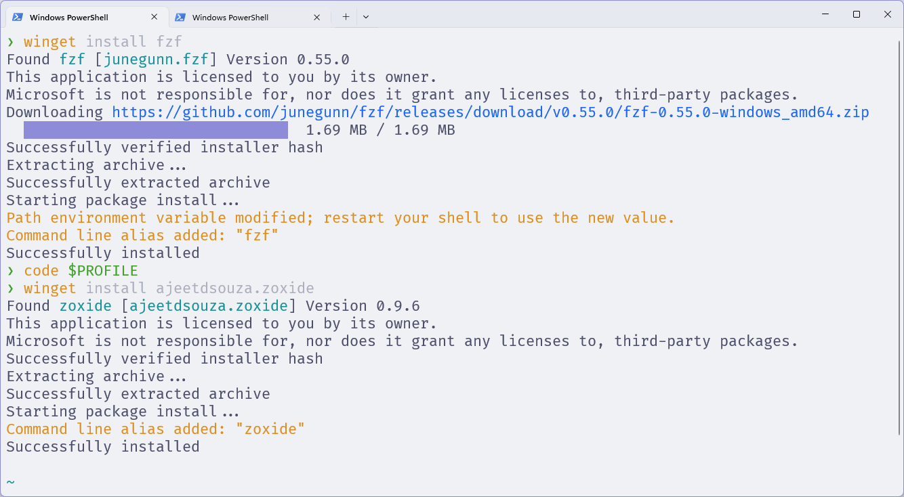
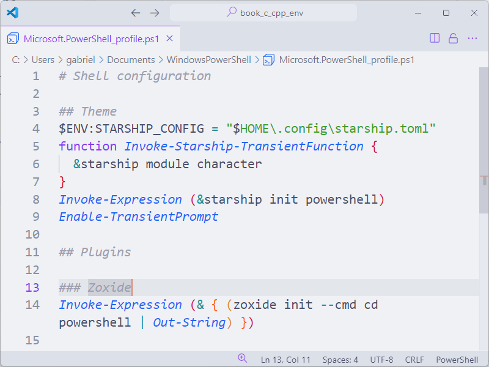
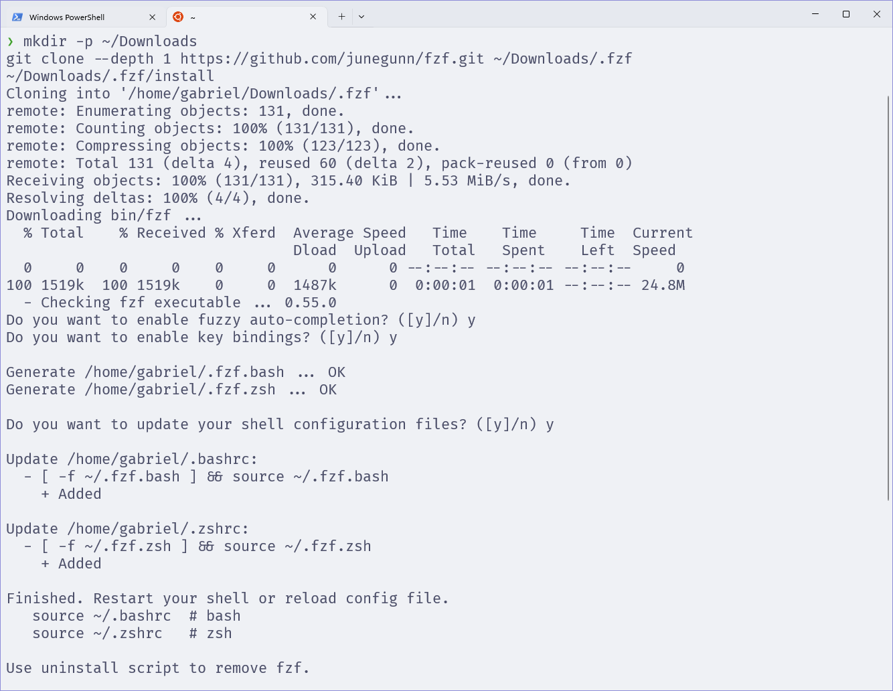
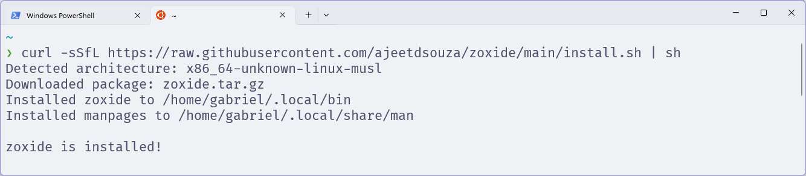
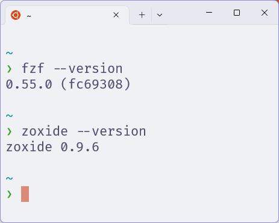

# Plugins

Plugins são uma forma de estender as funcionalidades do shell.
Para os sistemas que configuramos com o **Zsh**, utilizaremos o **Oh My Zsh**
Já para o **PowerShell**, instalaremos os plugins diretamente.

## Zoxide

O **Zoxide** é um plugin que facilita a navegação entre diretórios.

Por exemplo, imagine que você tenha um diretório chamado `~/Documents/Projects/MyProject`, que voê frequentemente acessa.

Ter que digitar esse caminho toda vez que quiser acessar esse diretório pode ser um pouco cansativo.
O Zoxide permite que você navegue para esse diretório apenas digitando `cd MyProject`.

Isso é possível porque o Zoxide mantém um histórico dos diretórios que você acessa com mais frequência.
E então, quando você digita `cd MyProject`, ele automaticamente navega para o diretório `~/Documents/Projects/MyProject`.

O Zoxide tem como dependência o **FZF**, que é um fuzzy finder.
O FZF é uma ferramenta que permite que você pesquise por arquivos e diretórios de forma rápida e eficiente.
Vamos tratar da instalação dele adiante.

### Powershell

Para instalar o FZF no PowerShell, execute o seguinte comando:

```powershell
winget install fzf
```

E então, instale o Zoxide com o seguinte comando:

```powershell
winget install ajeetdsouza.zoxide
```

<figure>

<figcaption>Instalando o FZF e o Zoxide no Powershell.</figcaption>
</figure>

Então, precisamos adicionar as seguintes linhas ao **final** do seu arquivo de configuração do PowerShell:

```powershell
## Plugins

### Zoxide
Invoke-Expression (& { (zoxide init --cmd cd powershell | Out-String) })
```

<figure>

<figcaption>Configurando o Zoxide no Powershell.</figcaption>
</figure>

Salve o arquivo, feche o editor, e então **feche** e abra novamente o Powershell para que as alterações tenham efeito.

### Zsh

Para instalar o FZF no Zsh, execute os seguintes comandos:

```bash
mkdir -p ~/Downloads
git clone --depth 1 https://github.com/junegunn/fzf.git ~/Downloads/.fzf
~/Downloads/.fzf/install
```

Quando perguntado sobre ativar os recursos do FZF, pressione a tecla <kbd>y</kbd> e então pressione <kbd>Enter</kbd> para cada.

<figure>

<figcaption>Instalando o FZF no Zsh.</figcaption>
</figure>

Para instalar o Zoxide, execute o seguinte comando:

```bash
curl -sSfL https://raw.githubusercontent.com/ajeetdsouza/zoxide/main/install.sh | sh
```

<figure>

<figcaption>Instalando o Zoxide no Zsh.</figcaption>
</figure>

Possivelmente, o FZF editou seu arquivo de configuração do Zsh.
Vamos excluir a linha que ele adicionou.
Então devemos mover o bloco `Plugins` para o final do arquivo, e adicionar as seguintes linhas:

```bash
### FZF
[ -f ~/.fzf.zsh ] && source ~/.fzf.zsh
source <(fzf --zsh)

### Zoxide
eval "$(zoxide init --cmd cd zsh)"
```

O arquivo de configuração do Zsh deve ficar assim:

```bash
# Path to your Oh My Zsh installation.
export ZSH="$HOME/.oh-my-zsh"

# Shell configuration
ZSH_THEME="robbyrussell"

## User configuration
PATH=$PATH:~/.local/bin

## Source Oh my Zsh
source $ZSH/oh-my-zsh.sh

## Theme
eval "$(starship init zsh)"
export STARSHIP_CONFIG="$HOME/.config/starship.toml"

## Plugins
plugins=(git)

### FZF
[ -f ~/.fzf.zsh ] && source ~/.fzf.zsh
source <(fzf --zsh)

### Zoxide
eval "$(zoxide init --cmd cd zsh)"
```

Salve o arquivo, feche o editor, e então **feche** e abra novamente o terminal para que as alterações tenham efeito.

Para testar se a instalação foi bem sucedida, execute os seguintes comandos:

```bash
fzf --version
zoxide --version
```

<figure>

<figcaption>Verificando as versões do FZF e do Zoxide no Zsh.</figcaption>
</figure>
