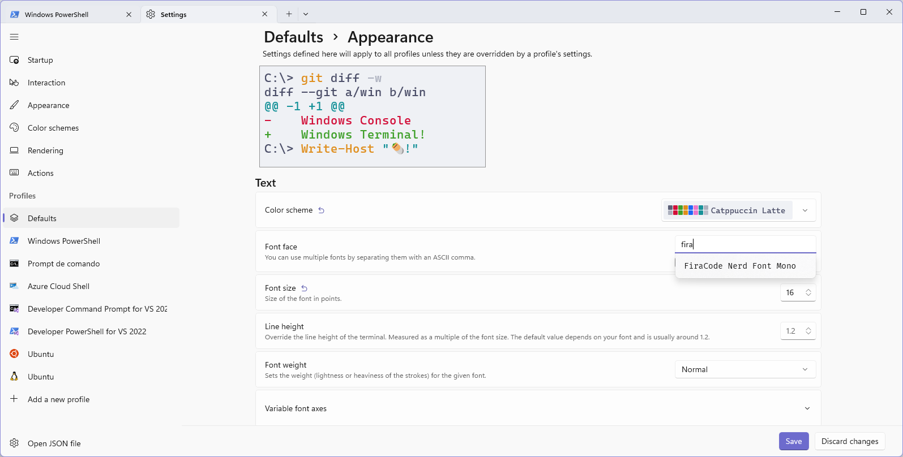
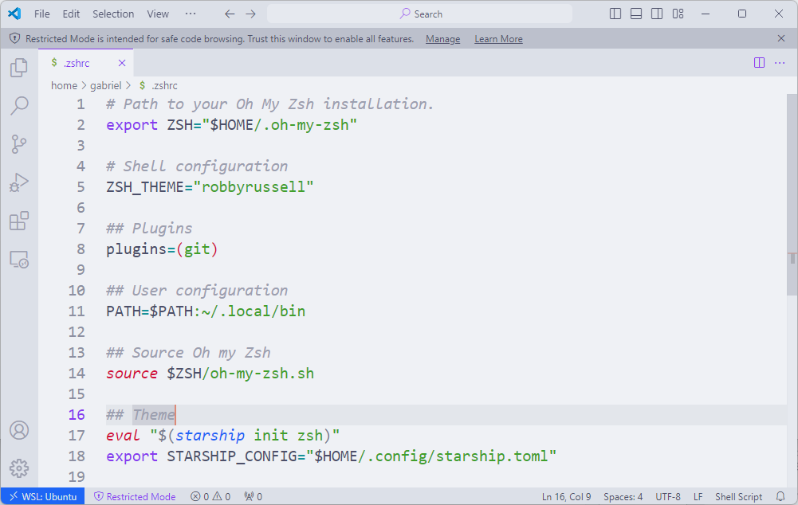

# Temas

Uma das partes mais legais de customizar o shell é definir um tema para o prompt!
Existem diversos frameworks para isso.

Neste capítulo, vamos tratar sobre o [**Starship**](https://starship.rs/), um prompt minimalista, rápido e extremamente customizável.

E, dessa vez, os usuários do **Windows** não ficarão de fora, pois o Starship é multiplataforma, e funciona no **PowerShell** e no **Zsh**!

## Fontes

Para que o Starship funcione corretamente, é necessário instalar uma fonte que suporte ícones no terminal.
Existe um padrão de fontes chamado **Nerd Fonts** que é muito utilizado para esse fim.

Acesse o site [nerdfonts.com](https://www.nerdfonts.com/font-downloads) e escolha a que mais lhe agradar.

Neste exemplo, vamos instalar a fonte **Fira Code**.
Encontre-a na lista de fontes e clique no botão **Download**.

<figure>

<figcaption>Opção de download da fonte FiraCode no site Nerd Fonts.</figcaption>
</figure>

O pacote Zip contém vários arquivos, que definem variações da fonte.
Aquelas que nos interessam são as terminadas em **Mono**.

<figure>

<figcaption>Fontes Mono selecionadas no explorador de arquivos.</figcaption>
</figure>

No Windows, selecione-as e pressione o botão direito do mouse.
Então, clique em **Abrir**.

<figure>

<figcaption>Janelas do instalador de fontes abertas.</figcaption>
</figure>

Isso abrirá uma janela do instalador para cada fonte.
Não tem jeito, tem que clicar em **Instalar** em cada uma delas.

No Linux, isso é mais fácil.
Após extrair o pacote, basta copiar os arquivos das variações para a pasta `~/.local/share/fonts`.

<!-- TODO: Ensinar a instalar fontes no Linux -->

Se quiser fazer pelo terminal, o abra na pasta em que estão os arquivos descompactados e execute o comando:

```bash
cp *.ttf ~/.local/share/fonts
```

Você também pode copiar e colar graficamente pelo gerenciador de arquivos.

### Definindo a fonte no terminal

Além de instalar a fonte, é necessário configurar o terminal para usá-la.

Já acessamos as configurações de fonte do GNOME Terminal e do Windows Terminal anteriormente.

Pelo GNOME Terminal, o passo a passo é :

<!-- TODO: explicar como definir a fonte -->

Já pelo Windows Terminal, acesse Configurações > Perfis > Perfil padrão > Aparência.

<figure>

<figcaption>Definindo a fonte Fira Code Mono no Windows Terminal.</figcaption>
</figure>

## Instalando o Starship

Para instalar o Starship, vamos seguir as instruções do [site oficial](https://starship.rs/guide/#step-1-install-starship).

Tanto no Windows como no Linux (e WSL), parte do processo é editar o arquivo de configurações do shell.
Vamos tratar sobre os detalhes de como fazer isso para o PowerShell e para o Zsh.

### PowerShell

O Starship pode ser instalado no Windows através do **PowerShell**.

Para obter o instalador e executar o script de instalação, rode o seguinte comando:

```powershell
winget install --id Starship.Starship
```

<figure>

<figcaption>Instalando o Starship no PowerShell.</figcaption>
</figure>

Após a instalação, é necessário adicionar o script de inicialização do Starship ao seu perfil do PowerShell.

O arquivo de configuração do PowerShell tem o nome `Microsoft.PowerShell_profile.ps1`.
Seu local de armazenamento pode variar de acordo com a versão do PowerShell.

O arquivo para o PowerShell 5 é encontrado em `$HOME\Documents\WindowsPowerShell\Microsoft.PowerShell_profile.ps1`.
Já para o PowerShell 7, o arquivo é encontrado em `$HOME\Documents\PowerShell\Microsoft.PowerShell_profile.ps1`.

Felizmente, o Windows provê uma variável de ambiente chamada `$PROFILE` que aponta justamente para esse arquivo.

As instruções deste capítulo valem para qualquer uma das duas versões.
Basta executar os comandos no terminal da versão que você utiliza.

Vamos abrir o arquivo de configuração com o VSCode, executando o comando:

```powershell
code $PROFILE
```

<figure>

<figcaption>Abrindo o arquivo de configuração do PowerShell com o Visual Studio Code.</figcaption>
</figure>

Adicione as seguintes linhas ao arquivo:

```powershell
# Shell configuration

## Theme
$ENV:STARSHIP_CONFIG = "$HOME\.config\starship.toml"
function Invoke-Starship-TransientFunction {
  &starship module character
}
Invoke-Expression (&starship init powershell)
Enable-TransientPrompt
```

<figure>

<figcaption>Arquivo de configuração do PowerShell com o comando para executar o Starship.</figcaption>
</figure>

Salve o arquivo e feche o editor.
Para que as alterações tenham efeito, **feche** e abra o terminal novamente.

Possivelmente, você verá uma mensagem de erro ao abrir o PowerShell.

<figure>

<figcaption>Mensagem de erro no PowerShell sobre execução de scripts.</figcaption>
</figure>

Essa mensagem é exibida porque o Windows não permite a execução de scripts por padrão.
Precisamos alterar a política de execução de scripts para que o Starship funcione.

Para isso, execute o comando:

```powershell
Set-ExecutionPolicy -ExecutionPolicy RemoteSigned -Scope CurrentUser
```

<figure>

<figcaption>Definindo a política de execução de scripts no PowerShell.</figcaption>
</figure>

Esse comando define que scripts que sejam assinados por fontes confiáveis podem ser executados.

**Feche** e abra o terminal novamente.
Para verificar se o Starship foi instalado corretamente, execute o comando `starship`.

<figure>

<figcaption>Verificando se o Starship foi instalado no PowerShell.</figcaption>
</figure>

### Zsh

No Linux e no WSL, o Starship pode ser instalado no **Zsh**.

Para instalar o Starship, execute o comando:

```bash
sudo curl -sS https://starship.rs/install.sh | sh
```

<figure>

<figcaption>Executando comando de instalação do Starship no Zsh.</figcaption>
</figure>

Quando perguntado se deseja prosseguir com a instalação, pressione a tecla <kbd>y</kbd>.

O instalador exibirá uma mensagem informando que o Starship foi instalado com sucesso, e que é necessário adicionar o script de inicialização ao arquivo de configurações do shell.

<figure>

<figcaption>Mensagem de sucesso da instalação do Starship no Zsh.</figcaption>
</figure>

O arquivo de configurações do Zsh é o `~/.zshrc`.
Vamos editá-lo usando o VSCode com o seguinte comando:

```bash
code ~/.zshrc
```

Adicione as seguintes linhas ao final do arquivo:

```bash
## Theme
eval "$(starship init zsh)"
export STARSHIP_CONFIG="$HOME/.config/starship.toml"
```

<figure>

<figcaption>Arquivo de configuração do Zsh configurado para ativar o Starship.</figcaption>
</figure>

Salve o arquivo e feche o editor.
Para que as alterações tenham efeito, **feche** e abra o terminal novamente.

Para verificar se o Starship foi instalado corretamente, execute o comando `starship`.

<figure>

<figcaption>Verificando se o Starship foi instalado no Zsh.</figcaption>
</figure>

## Configurando o Starship

O starship não é um tema, mas um framework para criar e definir temas.
Ele é extremamente customizável, e você pode definir o prompt do jeito que quiser.
Se quiser aprender mais sobre, acesse a [documentação oficial](https://starship.rs/config/).

Neste capítulo, vamos utilizar um dos temas já prontos, os quais são chamados de [presets](https://starship.rs/presets/).
Acesse o link e escolha o tema que mais lhe agrada.
Vamos utilizar o tema [Gruvbox Rainbow](https://starship.rs/presets/gruvbox-rainbow), mas o passo a passo é similar para qualquer outro.

O Starship também tem um arquivo de configuração chamado `starship.toml`, que é onde você pode definir as configurações do prompt.
Por padrão, este arquivo pode não existir.

Para criar um no **Ubuntu**, **Fedora** ou **WSL**, execute o comando:

```bash
mkdir -p ~/.config && touch ~/.config/starship.toml
```

Já no **Windows**, execute os comandos:

```powershell
mkdir -Force $HOME\.config
New-Item -Path $HOME\.config\starship.toml -ItemType File
```

Depois de criado, precisamos copiar o conteúdo de um preset para dentro desse arquivo.
O starship oferece um comando para fazer justamente isso.

No **Ubuntu**, **Fedora** ou **WSL**, execute o comando:

```bash
starship preset gruvbox-rainbow -o $STARSHIP_CONFIG
```

Já no **Windows**, execute o comando:

```powershell
starship.exe preset gruvbox-rainbow -o $ENV:STARSHIP_CONFIG
```

<figure>

<figcaption>Definindo o tema Gruvbox Rainbow no PowerShell.</figcaption>
</figure>

### Considerações

O Starship é um framework novo e em constante desenvolvimento.
Uma funcionalidade que foi implementada para o PowerShell, mas ainda não para o Zsh, é a de definir o prompt de forma transitória.

Isso significa que apenas a linha atual terá todos os detalhes do prompt, e as demais linhas terão um prompt mais simples.

<figure style="display:flex;flex-direction:column;max-width:100%;">
  <div style="display:flex;align-items:center;gap:1rem;max-width:100%;">
    
    
  </div>
  <figcaption>Comparação do Starship entre o Zsh e o PowerShell respectivamente.</figcaption>
</figure>

Caso você não goste de tantos detalhes nas linhas anteriores no Zsh, você pode escolher um tema mais simples.

Eu particularmente me incomodo com o prompt do Zsh, então vou trocar o tema para o [Nerd Font Symbols](https://starship.rs/presets/nerd-font).
O processo é o mesmo, bastando trocar o nome do tema no comando de configuração.
