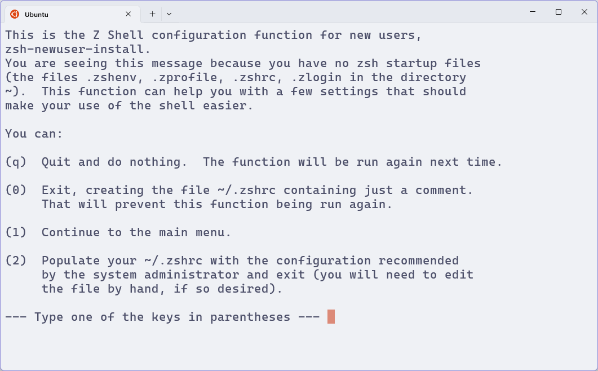
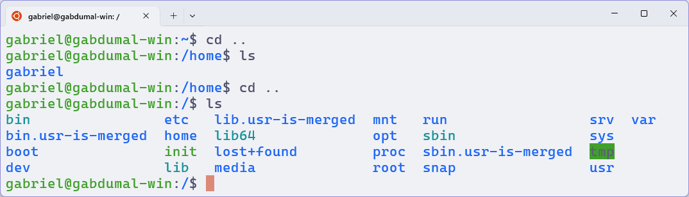
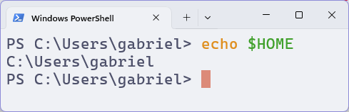
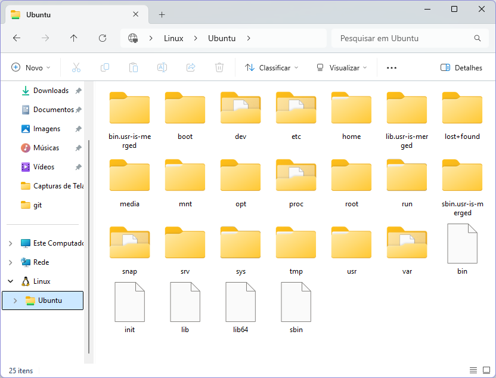
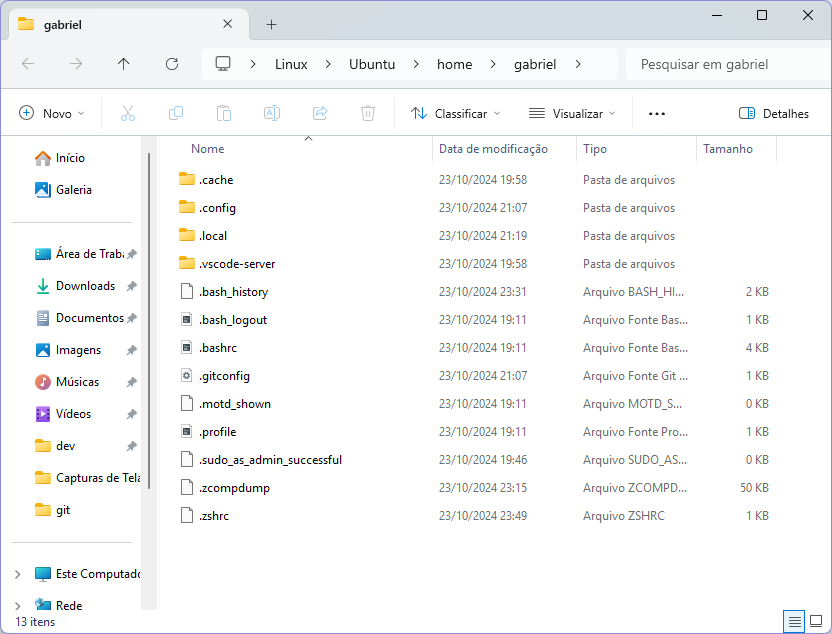

# Zsh

O **Zsh** é um shell que busca ser mais poderoso e flexível que o Bash (o shell padrão do Ubuntu e do Fedora)
Ele permite a instalação de uma série de plugins de forma mais simplificada.

Vamos instalá-lo já pensando em utilizar seu framework de customização [**Oh My Zsh**](https://github.com/ohmyzsh/ohmyzsh).
Mas tratemos dele mais adiante.

Para instalar o Zsh, vamos seguir as instruções do [site](https://github.com/ohmyzsh/ohmyzsh/wiki/Installing-ZSH) do Oh My Zsh.

## Instalação

### Ubuntu e WSL

Execute o comando abaixo no terminal:

```bash
sudo apt install zsh
```

Verifique a instalação com o comando:

```bash
zsh --version
```

E então o defina como o shell padrão:

```bash
chsh -s $(which zsh)
```

### Fedora

Execute o comando abaixo no terminal:

```bash
sudo dnf install zsh
```

Verifique a instalação com o comando:

```bash
zsh --version
```

E então o defina como o shell padrão:

```bash
sudo lchsh $USER
```

### Windows

Infelizmente, o Zsh não é suportado nativamente no Windows.
Ainda assim, instalaremos alguns plugins no PowerShell para aprimorá-lo.

## Estrutura de diretórios

Após instalar o Zsh, **feche** o terminal e abra-o novamente.
Se tudo correr bem, você verá o texto de boas-vindas do Zsh.

<figure>

<figcaption>Texto de boas-vindas do Zsh no Windows Terminal rodando o Ubuntu.</figcaption>
</figure>

O Zsh está pedindo para você criar um arquivo de configuração para ele.
O shell, assim como diversos outros programas no Linux utilizam arquivos de configuração para definir suas opções.

Pressione <kbd>0</kbd> para criar um arquivo vazio.
Não se preocupe, vamos preenchê-lo mais adiante.

O arquivo de configuração do Zsh é o `.zshrc`, assim mesmo, com ponto no começo e sem extensão.
Sua localização é na pasta do seu usuário do Linux.

Aqui vale um pequeno apanhado de como funciona a estrutura de diretórios no Linux.
Ela varia um pouco a depender da distribuição, mas a estrutura básica é a mesma.

- O sistema todo é organizado dentro de uma pasta, a qual chamamos de `ROOT` ou `/`.
  - Ela não tem realmente um nome, por isso a referenciamos apenas com uma barra.
- Dentro dela, temos diversas pastas, que são responsáveis por organizar, por exemplo:
  - `bin`: programas executáveis instalados a nível de sistema (pelo **apt** ou **dnf**)
  - `opt`: programas instalados manualmente a nível de sistema.
  - `usr`: programas instalados pelos usuários.
  - `etc`: arquivos de configuração do sistema.
  - `lib`: bibliotecas compartilhadas por programas.
  - `home`: pastas dos usuários.
  - `mnt`: referências a dispositivos de armazenamento montados no computador, como pendrives e HDs.

Há outras pastas (chamadas comumente de **diretórios**) importantes, mas com o tempo você pega o jeito.

<figure>

<figcaption>Estrutura de pastas da raiz do Ubuntu (WSL).</figcaption>
</figure>

A que nos interessa no momento é a pasta `home`.
Dentro dela, o sistema cria uma pasta para cada usuário, nomeada com o nome do usuário.
Por exemplo, o meu usuário é `gabriel`, então a pasta do meu usuário é `/home/gabriel`.

Essa pasta é tão importante que ela tem uma variável de ambiente que a referencia, chamada de `HOME`.

Pressione <kbd>q</kbd> para sair do texto de boas-vindas do Zsh.
Digite no terminal o comando `echo $HOME` e veja o que aparece.
Depois, digite `echo $HOME` no PowerShell e veja o que aparece.

Tanto o Windows quanto o Linux possuem essa variável de ambiente, mas perceba que o caminho é diferente!

<figure>
<div style="display:flex;flex-direction:column;align-items:center;gap:1rem;">


</div>
<figcaption>Comando para exibir a variável de ambiente HOME no Ubuntu e no Powershell, respectivamente.</figcaption>
</figure>

De fato, eu uso o mesmo usuário no Ubuntu e no Windows, mas o caminho da pasta do usuário é diferente porque se tratam de duas pastas completamente distintas.

O WSL cria de fato todo um novo ambiente de emulação dentro do Windows, com suas próprias pastas e configurações.
Mas como acessar esse ambiente?

Se tudo tiver sido instalado corretamente, você verá uma nova entrada no Explorador de Arquivos chamada `Linux`.
Dentro dela, haverá uma pasta chamada `Ubuntu`.
Essa é justamente a pasta `/` (raiz) do Ubuntu, a qual mencionamos anteriormente.

<figure>

<figcaption>Pasta raiz do Ubuntu WSL exibida no Explorador de Arquivos.</figcaption>
</figure>

Acesse a pasta `home`, e então a pasta do seu **usuário**.

<figure>

<figcaption>Pasta HOME exibida no Explorador de Arquivos.</figcaption>
</figure>

Vemos que há vários arquivos e pastas dentro do diretório do usuário.
O arquivo `.bashrc` é o arquivo de configuração do Bash, o shell padrão do Ubuntu.
Já o arquivo `.zshrc` acabou de ser criado pelo Zsh após a mensagem de boas-vindas.
