# GNOME Terminal

Este subcapítulo aborda o **GNOME Terminal**, o emulador de terminal padrão do **Ubuntu** e do **Fedora**.

Pesquise por `Terminal` no menu do GNOME e clique no ícone do aplicativo para abri-lo.

<figure>
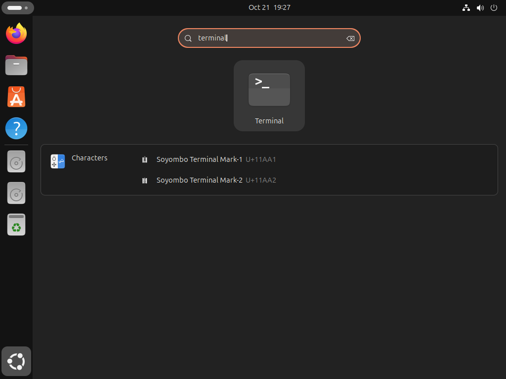
<figcaption>Buscando pelo Terminal no menu de apps do GNOME.</figcaption>
</figure>

O GNOME terminal também pode ser aberto por um comando!
Digite `gnome-terminal` no terminal e pressione <kbd>Enter</kbd>.

<figure>
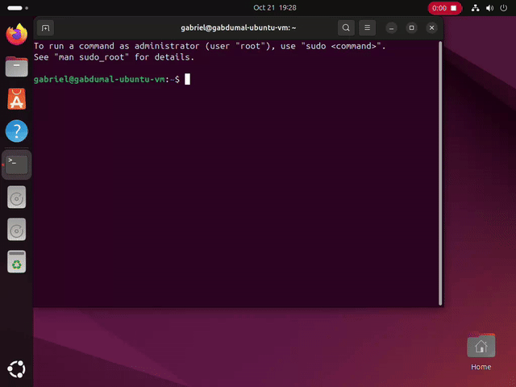
<figcaption>Buscando pelo Terminal no menu de apps do GNOME.</figcaption>
</figure>

## Atalho de teclado

Um atalho de teclas comumente utilizado para abrir o terminal é `Ctrl + Alt + T`.
O Ubuntu o tem configurado por padrão.
Já no Fedora, você pode defini-lo em `Settings > Keyboard > View and Customize Shortcuts > Custom Shortcuts`.

<figure>
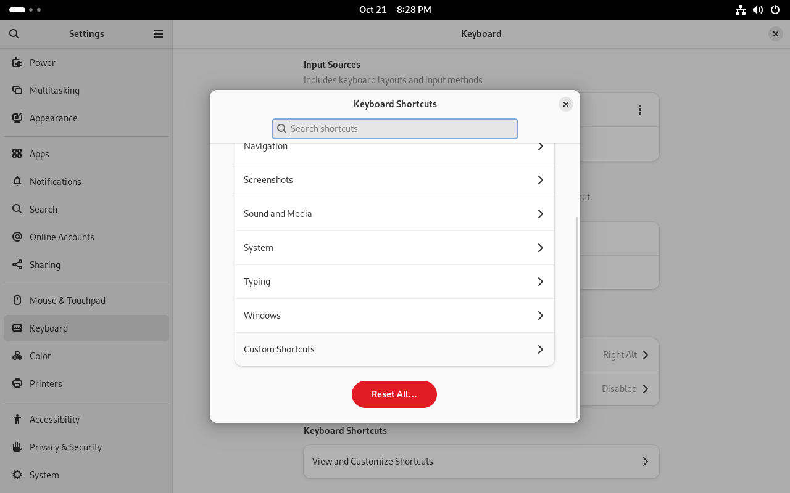
<figcaption>Selecionando menu de atalhos de teclado nas configurações do GNOME.</figcaption>
</figure>

Então, defina o nome como `Terminal`, o comando como `gnome-terminal` e o atalho de teclado como <kbd>Ctrl + Alt + T</kbd>.
Pressione `Add` e pronto!

<figure>
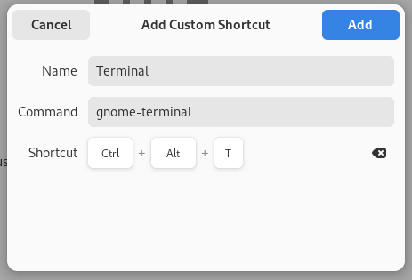
<figcaption>Definindo o atalho para abrir o GNOME terminal.</figcaption>
</figure>

## Perfis

O GNOME Terminal permite a criação de perfis, que são configurações personalizadas para o terminal.

Abra o menu do terminal e selecione `Preferences`.

<figure>
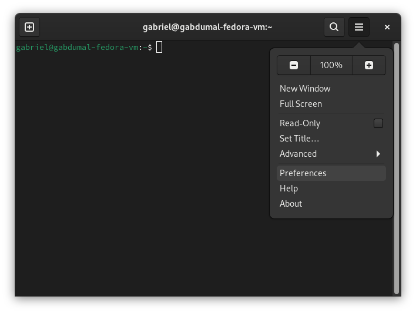
<figcaption>Abrindo o menu de preferências do GNOME Terminal.</figcaption>
</figure>

Eu prefiro um tema claro, então selecionei `Light style` na opção de variante de tema.

<figure>
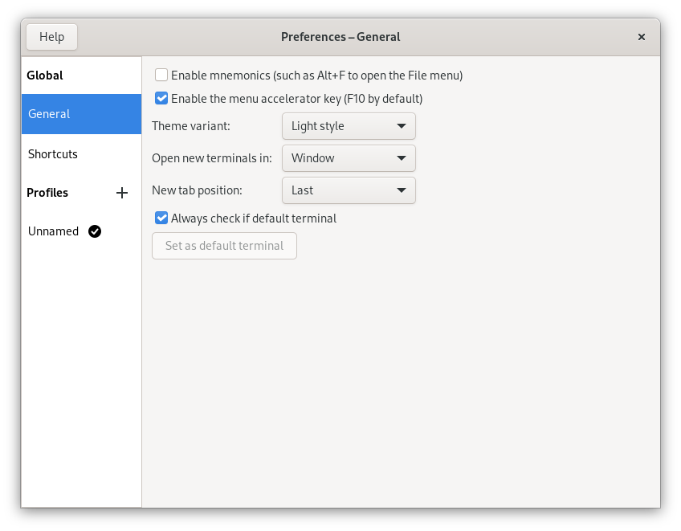
<figcaption>Selecionando a variante de tema clara.</figcaption>
</figure>

Por padrão, o GNOME Terminal tem um perfil chamado `Unnamed`.
Clicando nele, podemos ver as definições padrão.

<figure>
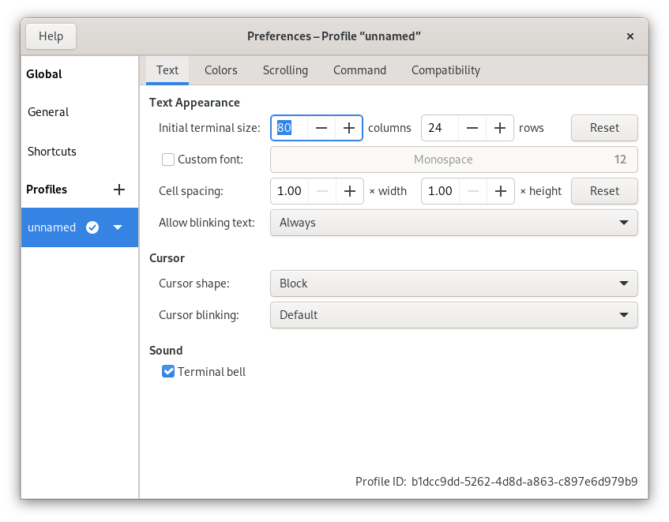
<figcaption>Definições padrão do perfil "Unnamed".</figcaption>
</figure>

Você pode alterar todas as configurações do terminal, como fonte, cores, cursor, etc.
Porém, é meio trabalhoso fazer tudo isso.

Então, eu gosto de usar um tema bastante popular chamado `Catppuccin`!
Ele é um projeto que oferece personalização para uma série de programas.
Você pode optar entre quatro variantes: Latte, Frappé, Macchiato e Mocha.

Para instalar o tema, execute o script de instalação oferecido no [repositório do projeto](https://github.com/catppuccin/gnome-terminal?tab=readme-ov-file#usage).

```bash
curl -L https://raw.githubusercontent.com/catppuccin/gnome-terminal/v0.3.0/install.py | python3 -
```

<figure>
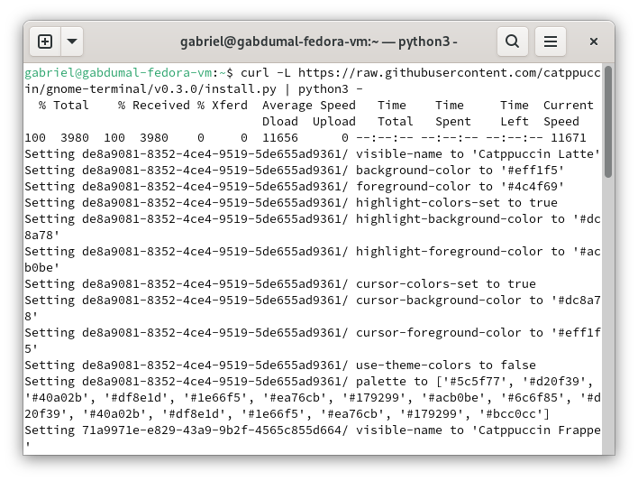
<figcaption>Instalando o tema Catppuccin para o GNOME Terminal.</figcaption>
</figure>

Depois de instalado, abra as preferências do terminal e selecione o perfil que mais lhe agrada.
Eu gosto do `Catppuccin Latte`.

Para isso, clique no botão `▾` ao lado do nome do tema, e selecione `Set as default`.

<figure>
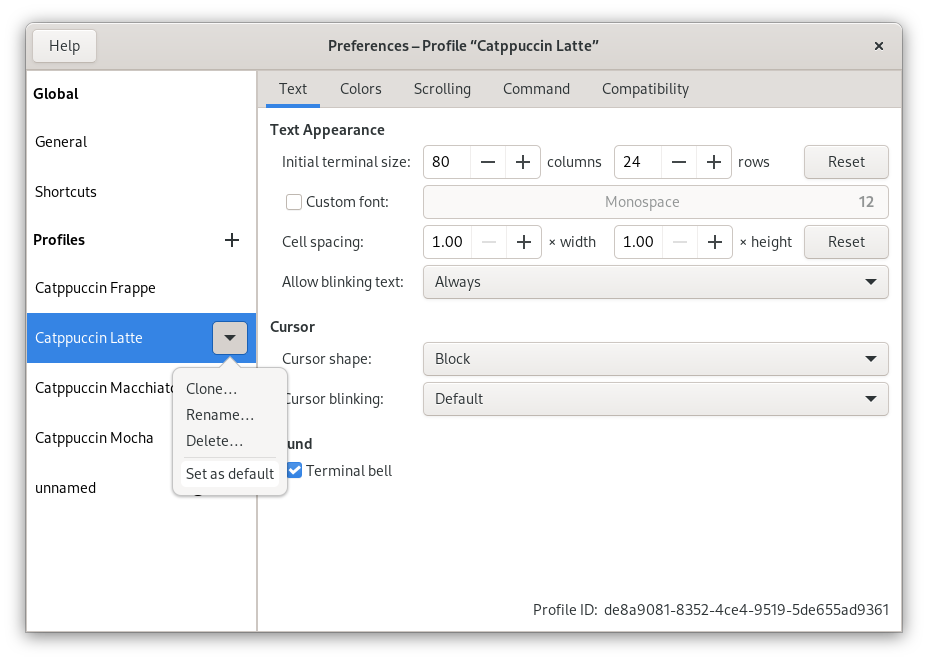
<figcaption>Definindo o tema Catppuccin Latte como padrão.</figcaption>
</figure>

Por último, eu gosto de aumentar o tamanho da fonte para 16.

Clique na caixa de seleção com a legenda `Custom font:`, e então clique no botão ao lado, com o texto `Monospace 12`.

Você pode então selecionar sua fonte de preferência, e o tamanho dela.

<figure>
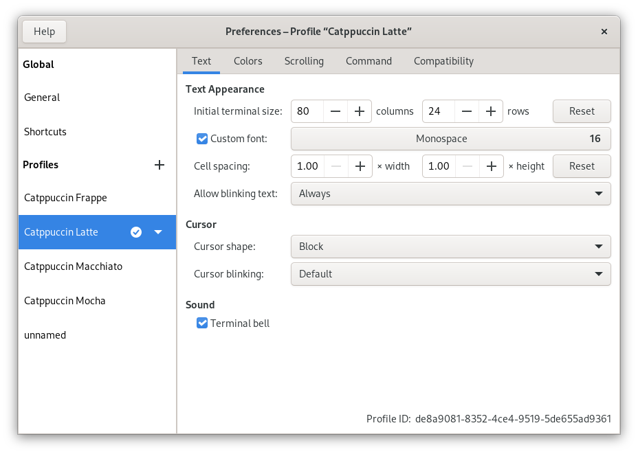
<figcaption>Definições do perfil após mudar o tamanho da fonte.</figcaption>
</figure>

Para carregar as modificações, feche e abra o terminal novamente.

<figure>
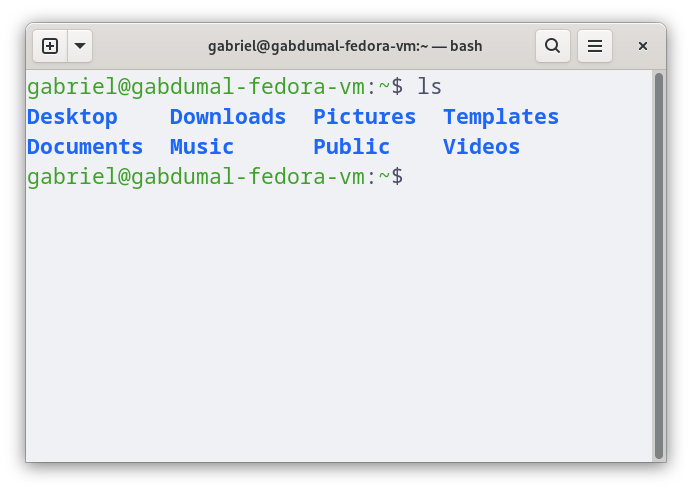
<figcaption>Aparência final do terminal após mudar o tema.</figcaption>
</figure>
