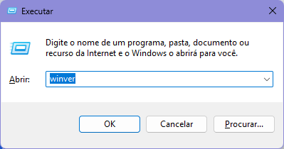

# Windows Subsystem for Linux { #wsl }

O **Windows Subsystem for Linux (WSL)** é uma ferramenta de código aberto apoiada pela Microsoft que permite a emulação de um sistema operacional Linux dentro do Windows.
A atual versão na data de escrita deste livro é a 2, que traz grandes melhorias em relação à versão anterior.

O WSL permite instalar diversas distribuições Linux, até mesmo concomitantemente.
Este [guia oficial](https://learn.microsoft.com/en-us/windows/wsl/install-manual#step-6---install-your-linux-distribution-of-choice) da Microsoft mostra algumas opções.
Para este guia, vamos nos manter na distribuição **Ubuntu**, que é a padrão do WSL.

## Pré-requisitos

Se você estiver usando o **Windows 11**, ou o **Windows 10 versão 2004** (Build 19041) ou superior, o WSL 2 já estará habilitado, e você pode pular para a próxima seção.

<div class="warning">
  <p>
    Para verificar a versão do seu Windows, pressione <kbd>Win</kbd> + <kbd>R</kbd> e digite <code>winver</code>. Então, pressione <kbd>Enter</kbd>.
  </p>
  <figure>
    
    <figcaption>Verificando a versão do Windows pelo Executar.</figcaption>
  </figure>
</div>

Caso utilize uma versão mais antiga, seguiremos os passos recomendados pelo [guia oficial](https://learn.microsoft.com/en-us/windows/wsl/install-manual#step-1---enable-the-windows-subsystem-for-linux) da Microsoft.

Ainda assim, para sistemas com arquitetura x64, é necessário ter instalado a **versão 1903** do Windows 10 ou posterior, com a Build 18362.1049 ou posterior.
Versões mais antigas do Windows 10 não possuem suporte para o WSL 2.

Como alternativa, você pode ler o capítulo [Instalando o MSVC](/src/chapters/installing_msvc/index.md) para compilar programas diretamente para executáveis do Windows.

<!-- TODO: Atualizar link para o capítulo -->

### Habilitando o WSL

Para habilitar o WSL no sistema, abra o PowerShell como **administrador** e execute o comando abaixo.

```powershell
dism.exe /online /enable-feature /featurename:Microsoft-Windows-Subsystem-Linux /all /norestart
```

<div class="warning">
  <p>
    Lembre-se, para abrir o PowerShell como administrador, clique com o botão direito na entrada do PowerShell no Menu Iniciar e selecione a opção <span class="bold">Executar como administrador</span>.
  </p>
  <figure>
    
    <figcaption>Executando o Powershell como administrador a partir do Menu Iniciar.</figcaption>
  </figure>
</div>

### Habilitando a Virtualização

Para habilitar a virtualização no sistema, execute o comando abaixo no PowerShell como **administrador**.

```powershell
dism.exe /online /enable-feature /featurename:VirtualMachinePlatform /all /norestart
```

### Atualizando para o WSL 2

Baixe o pacote de atualização do WSL 2 pelo [repositório da Microsoft](https://wslstorestorage.blob.core.windows.net/wslblob/wsl_update_x64.msi) e instale-o.
Você pode verificar a origem do link pelo [guia oficial](https://learn.microsoft.com/en-us/windows/wsl/install-manual#step-4---download-the-linux-kernel-update-package) da Microsoft.

Após o download, execute o instalador e siga as instruções.

### Definindo o WSL 2 como padrão

Por fim, defina a versão 2 do WSL como padrão com o comando abaixo, ainda no PowerShell como **administrador**.

```powershell
wsl --set-default-version 2
```

## Instalando o WSL

Primeiramente, devemos instalar o WSL propriamente dito.
Para isso, abra o **PowerShell** e execute o comando abaixo.

```powershell
wsl.exe --install --no-distribution
```

<figure>

<figcaption>Processo de instalação do WSL pelo Powershell.</figcaption>
</figure>

Quando eu instalei, usei apenas o comando `wsl.exe --install`, sem o `--no-distribution`.
Confesso que o meu processo ficou travado nessa última linha `Habilitando recurso(s)`.
Depois de um minuto eu fechei o terminal e abri novamente.

Digitando `wsl`, recebi a seguinte mensagem: `O Subsistema do Windows para Linux não tem distribuições instaladas`.

<figure>

<figcaption>Resultado do comando <code>wsl</code> após a execução do comando de instalação.</figcaption>
</figure>

Por isso, recomendo para vocês usarem o comando `wsl.exe --install --no-distribution` para evitar esse problema de cara, e instalar apenas o sistema base mesmo.

Bom, agora que temos o WSL, vamos instalar uma distribuição Linux!
Mas, por precaução, **reinicie o computador** antes de prosseguir.

## Instalando o Ubuntu

Agora que o WSL está habilitado, podemos instalar a distribuição Ubuntu.

A maneira mais fácil de fazer isso é pela Microsoft Store.
Procure por uma aplicação chamada **Ubuntu**, sem indicar a versão.
Ela é a primeira opção da imagem a seguir.

<figure>

<figcaption>Opções de instalações do Ubuntu pela Microsoft Store, em que se seleciona a Ubuntu.</figcaption>
</figure>

Você também pode acessar essa página pelo [link direto](https://www.microsoft.com/store/productId/9PDXGNCFSCZV?ocid=pdpshare).

Clique no botão de instalar, e aguarde o download e instalação da distribuição.

<figure>

<figcaption>Processo de instalação do Ubuntu para o WSL.</figcaption>
</figure>

## Configurando o Ubuntu

Pesquise pelo **Ubuntu** no Menu Iniciar e abra o aplicativo.

<figure>

<figcaption>Entrada do Ubuntu no Menu Iniciar.</figcaption>
</figure>

O que será aberto, na verdade, é uma janela do terminal.
Após aguardar alguns segundos, o sistema pedirá para criar um **usuário e senha**.

Eu usei o mesmo usuário do Windows, mas você pode criar um novo usuário se preferir.
Outro detalhe é que, nos sistemas Linux, a senha não aparece enquanto você digita, fica apenas o **espaço em branco** mesmo. Não se preocupe, digite-a até o final e pressione <kbd>Enter</kbd>.
Após repetir a senha, pressione <kbd>Enter</kbd> novamente.

O sistema fará as últimas configurações e criara um usuário de administrador para você dentro do Ubuntu.

<figure>

<figcaption>Processo de criação de usuário do Ubuntu pelo terminal.</figcaption>
</figure>

Lembre-se da sua senha, pois ela será solicitada sempre que você precisar de permissões de administrador.

Em caso de esquecê-la, deixo aqui um [guia](https://www.howtogeek.com/devops/how-to-reset-your-forgotten-linux-password-in-wsl/) de como recuperá-la.

## Configurando o Windows Terminal

Se tudo tiver corrido bem, você verá uma nova entrada para o Ubuntu na aba de perfis do **Windows Terminal**.

<figure>

<figcaption>Opção do ubuntu na lista de perfis do Windows Terminal.</figcaption>
</figure>

Eu acho mais prático ter o Ubuntu como padrão quando inicio o terminal.
Para isso, abra as configurações do Windows Terminal.
Na seção `Startup` (ou `Inicialização`), você pode definir o perfil padrão.
Selecione a entrada do ubuntu com o ícone laranja e clique em `Salvar`.

<figure>

<figcaption>Definindo o perfil do Ubuntu como a opção de inicialização padrão do Windows Terminal.</figcaption>
</figure>

## Atualizando os pacotes

A maioria das ferramentas que você instalará no Ubuntu será por meio do gerenciador de pacotes `apt`.
Para garantir que tudo está atualizado, execute o comando abaixo.

```bash
sudo apt update
```

Então, para de fato instalar as atualizações, execute o comando abaixo.

```bash
sudo apt upgrade
```

A palavra `sudo` é usada para executar um comando com permissões de administrador.
Ela solicitará a senha do usuário que você criou anteriormente.

<figure>

<figcaption>Atualizando os pacotes do Ubuntu.</figcaption>
</figure>
